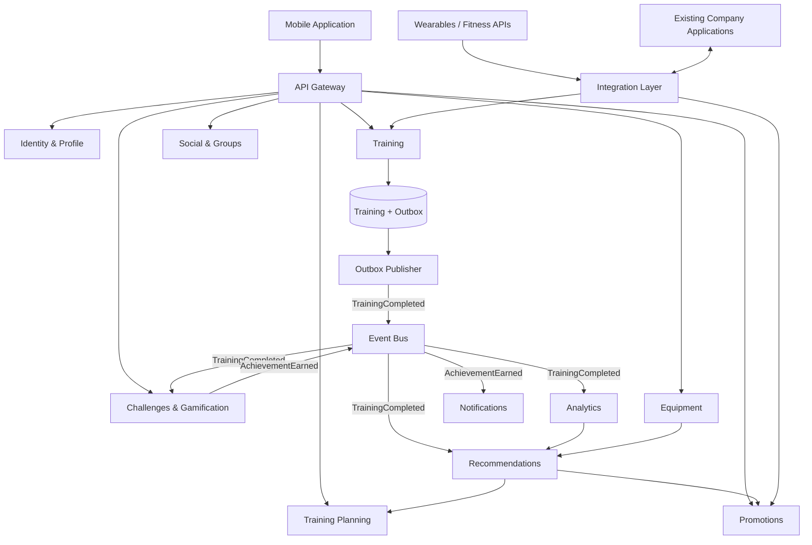

# 13. Базовая архитектура

## 1. Общий подход

Архитектура системы строится вокруг крупных бизнес-доменов.

Синхронное взаимодействие применяется в сценариях, где пользователь ожидает
немедленный результат.

Асинхронное event-driven взаимодействие применяется для вторичных операций,
которые не должны блокировать основной пользовательский сценарий.

К таким операциям относятся:

- расчёт статистики;
- обновление достижений;
- обновление рейтингов;
- отправка уведомлений;
- формирование рекомендаций.

---

## 2. Архитектурная схема

Диаграмма отражает логические доменные границы целевой архитектуры.
Она не означает, что каждый компонент должен с первого релиза развёртываться
как отдельный микросервис.

На ранних этапах несколько доменов могут находиться в одном deployable unit.
Физическое разделение выполняется при наличии подтверждённой необходимости
независимого масштабирования, развёртывания, владения командой или изоляции
отказов, в соответствии с [ADR-001](../adr/ADR-001-architecture-style.md).



---

# 3. Основные компоненты

## API Gateway

Единая точка входа для мобильного приложения.

Отвечает за маршрутизацию запросов к соответствующим backend-компонентам.

---

## Identity & Profile

Отвечает за:

- пользователей;
- профили;
- спортивные интересы;
- пользовательские настройки;
- настройки приватности.

---

## Training

Центральный компонент работы с тренировками.

Отвечает за:

- создание тренировки;
- сохранение результатов;
- историю тренировок;
- основные показатели тренировки;
- публикацию событий о завершении тренировок.

Training сохраняет тренировку и Outbox Event в одной локальной транзакции.
Outbox Publisher отправляет события в Event Bus независимо от пользовательского
ответа, согласно [ADR-014](../adr/ADR-014-transactional-outbox.md).

---

## Social & Groups

Отвечает за:

- социальные связи;
- группы;
- поиск пользователей;
- совместные спортивные активности.

---

## Challenges & Gamification

Отвечает за:

- достижения;
- спортивные челленджи;
- соревнования;
- рейтинги.

При обнаружении нового достижения сохраняет его и публикует `AchievementEarned`.

---

## Analytics

Отвечает за:

- расчёт показателей;
- статистику;
- сравнение результатов;
- агрегированные спортивные данные.

---

## Recommendations

Отвечает за персонализированные рекомендации.

При формировании рекомендаций могут учитываться:

- история тренировок;
- статистика;
- спортивные интересы;
- используемый инвентарь.

---

## Training Planning

Отвечает за:

- планы тренировок;
- расписание;
- рекомендации по дальнейшим занятиям.

---

## Equipment

Хранит сведения о спортивном инвентаре пользователя.

---

## Promotions

Отвечает за:

- спортивные новости;
- персонализированные предложения;
- региональные промоакции;
- интеграцию со сценариями покупки товаров.

---

## Notifications

Отвечает за отправку уведомлений о:

- достижениях;
- соревнованиях;
- социальных событиях;
- других событиях приложения.

Уведомления о достижениях инициируются событием `AchievementEarned` от Gamification,
а не самим фактом завершения тренировки. Подписки на другие события допустимы,
если уведомление относится непосредственно к соответствующему событию.

---

## Integration Layer

Изолирует внутренние компоненты платформы от особенностей конкретных внешних систем.

Через него выполняется взаимодействие с:

- wearable-устройствами;
- фитнес-функциями мобильных платформ;
- существующими приложениями компании.

---

# 4. Синхронное взаимодействие

Синхронное взаимодействие применяется там, где пользователь ожидает
непосредственный ответ.

Примеры:

- получение профиля;
- просмотр истории тренировок;
- поиск группы;
- просмотр расписания;
- получение результатов конкретной тренировки.

---

# 5. Асинхронное взаимодействие

После завершения тренировки Training валидирует данные и сохраняет тренировку
вместе с Outbox Event в одной локальной транзакции. После commit backend
подтверждает сохранение пользователю, не ожидая вторичной обработки.
Outbox Publisher публикует `TrainingCompleted` в Event Bus и помечает запись
опубликованной после подтверждения broker.

Далее событие обрабатывается независимо:

```text
TrainingCompleted
       |
       +--> Analytics
       +--> Gamification --> AchievementEarned --> Event Bus --> Notifications
       +--> Recommendations
```

Такой подход позволяет не блокировать сохранение тренировки дополнительными
вычислениями.

Результаты вторичной обработки могут появляться с небольшой задержкой
из-за eventual consistency. Consumers обрабатывают повторные сообщения идемпотентно.

---

# 6. Адресация атрибутов качества

## 6.1. Масштабируемость

Для обеспечения масштабируемости используются:

- независимое масштабирование доменных компонентов;
- горизонтальное масштабирование stateless-компонентов;
- асинхронная обработка;
- очереди событий;
- кеширование;
- возможность регионального размещения системы при подтверждённых требованиях (ADR-011, Proposed).

Особенно важна возможность независимо масштабировать:

- Training;
- Analytics;
- Gamification;
- Notifications.

---

## 6.2. Надёжность

Для повышения надёжности используются:

- offline-first регистрация тренировок;
- локальное сохранение данных на мобильном устройстве;
- повторные попытки доставки;
- идемпотентная обработка;
- Transactional Outbox для атомарного сохранения тренировки и события;
- очереди сообщений;
- retry;
- изоляция отказов внешних систем.

Ключевой принцип:

> Отказ вспомогательного компонента не должен приводить к потере тренировки.

Например:

```text
Training
   |
   +--> DB transaction: Training + Outbox Event
   |
   +--> Success response
   |
   +--> Outbox Publisher --> Event Bus --> Background consumers
                                             |
                                             +--> Notifications temporarily unavailable
```

Недоступность Notifications не влияет на сохранность тренировки.

---

## 6.3. Безопасность и конфиденциальность

Архитектура предусматривает:

- централизованную аутентификацию;
- авторизацию;
- защищённые соединения;
- шифрование чувствительной информации;
- минимизацию собираемых данных;
- управление пользовательскими согласиями;
- настройки приватности;
- аудит критичных операций;
- разграничение доступа компонентов;
- защищённое хранение секретов.

Особое внимание уделяется:

- геолокации;
- маршрутам тренировок;
- текущему местоположению;
- данным о состоянии организма.

---

# 7. Связь требований и архитектуры

| Требование / атрибут | Архитектурное решение |
|---|---|
| Глобальные пользователи: BG-04, NFR-GLOBAL-01, NFR-GLOBAL-02, NFR-GLOBAL-03, NFR-GLOBAL-04 | UTC, пользовательские timezone, локализация и региональный контекст; региональное развёртывание — возможное развитие (ADR-011, Proposed) |
| Массовые соревнования: QA-01, NFR-SCALE-02 | event-driven обработка и независимое масштабирование |
| Нестабильное соединение: NFR-REL-03, CS-02 | offline-first мобильный клиент (ADR-005) |
| Надёжность: QA-02, NFR-REL-01, NFR-REL-02 | Transactional Outbox (ADR-014), retry, idempotency, очереди |
| Внешние устройства: NFR-INT-01 | Integration Layer (ADR-007) |
| Социальный поиск: FR-SOCIAL-02, FR-SOCIAL-03, FR-SOCIAL-04 | Social-компонент; специализированный географический индекс — при необходимости (ADR-009, Proposed) |
| Масштабируемость: QA-01, NFR-SCALE-01 | независимые доменные компоненты (ADR-001) |
| Безопасность: QA-03, NFR-SEC-01, NFR-SEC-02, NFR-SEC-03 | защищённые соединения и хранение, централизованная аутентификация и авторизация |
| Конфиденциальность: QA-03, NFR-SEC-04 | privacy settings и consent management (ADR-010) |
| Расширяемость: BG-04, NFR-EXT-01 | доменные границы и события |
| Наблюдаемость: NFR-OBS-01 | централизованные logs, metrics и tracing (ADR-013) |
