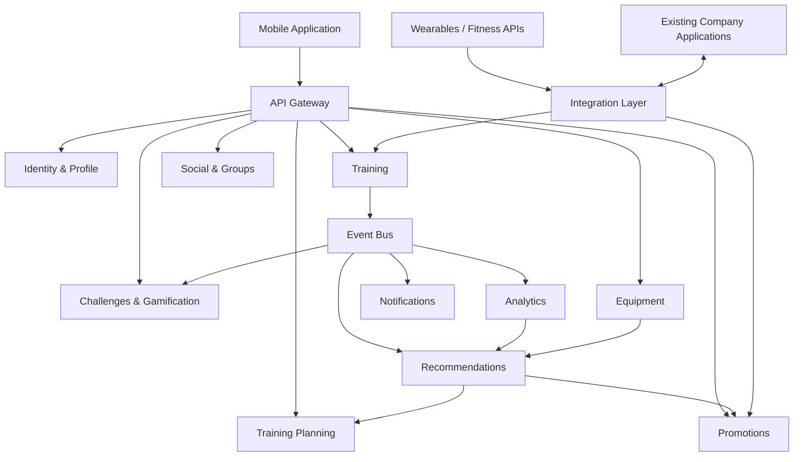

# 13. Базовая архитектура

## 1. Общий подход

Архитектура системы строится вокруг крупных бизнес-доменов.

Синхронное взаимодействие применяется в сценариях, где пользователь ожидает
немедленный результат.

Асинхронное event-driven взаимодействие применяется для вторичных операций,
которые не должны блокировать основной пользовательский сценарий.

К таким операциям относятся:

- расчёт статистики;
- обновление достижений;
- обновление рейтингов;
- отправка уведомлений;
- формирование рекомендаций.

---

## 2. Архитектурная схема



---

# 3. Основные компоненты

## API Gateway

Единая точка входа для мобильного приложения.

Отвечает за маршрутизацию запросов к соответствующим backend-компонентам.

---

## Identity & Profile

Отвечает за:

- пользователей;
- профили;
- спортивные интересы;
- пользовательские настройки;
- настройки приватности.

---

## Training

Центральный компонент работы с тренировками.

Отвечает за:

- создание тренировки;
- сохранение результатов;
- историю тренировок;
- основные показатели тренировки;
- публикацию событий о завершении тренировок.

---

## Social & Groups

Отвечает за:

- социальные связи;
- группы;
- поиск пользователей;
- совместные спортивные активности.

---

## Challenges & Gamification

Отвечает за:

- достижения;
- спортивные челленджи;
- соревнования;
- рейтинги.

---

## Analytics

Отвечает за:

- расчёт показателей;
- статистику;
- сравнение результатов;
- агрегированные спортивные данные.

---

## Recommendations

Отвечает за персонализированные рекомендации.

При формировании рекомендаций могут учитываться:

- история тренировок;
- статистика;
- спортивные интересы;
- используемый инвентарь.

---

## Training Planning

Отвечает за:

- планы тренировок;
- расписание;
- рекомендации по дальнейшим занятиям.

---

## Equipment

Хранит сведения о спортивном инвентаре пользователя.

---

## Promotions

Отвечает за:

- спортивные новости;
- персонализированные предложения;
- региональные промоакции;
- интеграцию со сценариями покупки товаров.

---

## Notifications

Отвечает за отправку уведомлений о:

- достижениях;
- соревнованиях;
- социальных событиях;
- других событиях приложения.

---

## Integration Layer

Изолирует внутренние компоненты платформы от особенностей конкретных внешних систем.

Через него выполняется взаимодействие с:

- wearable-устройствами;
- фитнес-функциями мобильных платформ;
- существующими приложениями компании.

---

# 4. Синхронное взаимодействие

Синхронное взаимодействие применяется там, где пользователь ожидает
непосредственный ответ.

Примеры:

- получение профиля;
- просмотр истории тренировок;
- поиск группы;
- просмотр расписания;
- получение результатов конкретной тренировки.

---

# 5. Асинхронное взаимодействие

После завершения тренировки Training может опубликовать:

`TrainingCompleted`

Далее событие обрабатывается независимо:

```text
TrainingCompleted
       |
       +--> Analytics
       +--> Gamification
       +--> Notifications
       +--> Recommendations
```

Такой подход позволяет не блокировать сохранение тренировки дополнительными
вычислениями.

---

# 6. Адресация атрибутов качества

## 6.1. Масштабируемость

Для обеспечения масштабируемости используются:

- независимое масштабирование доменных компонентов;
- горизонтальное масштабирование stateless-компонентов;
- асинхронная обработка;
- очереди событий;
- кеширование;
- возможность регионального размещения системы.

Особенно важна возможность независимо масштабировать:

- Training;
- Analytics;
- Gamification;
- Notifications.

---

## 6.2. Надёжность

Для повышения надёжности используются:

- offline-first регистрация тренировок;
- локальное сохранение данных на мобильном устройстве;
- повторные попытки доставки;
- идемпотентная обработка;
- очереди сообщений;
- retry;
- изоляция отказов внешних систем.

Ключевой принцип:

> Отказ вспомогательного компонента не должен приводить к потере тренировки.

Например:

```text
Training
   |
   +--> Training saved
   |
   +--> Event published
   |
   +--> Notification temporarily unavailable
```

Недоступность Notifications не влияет на сохранность тренировки.

---

## 6.3. Безопасность и конфиденциальность

Архитектура предусматривает:

- централизованную аутентификацию;
- авторизацию;
- защищённые соединения;
- шифрование чувствительной информации;
- минимизацию собираемых данных;
- управление пользовательскими согласиями;
- настройки приватности;
- аудит критичных операций;
- разграничение доступа компонентов;
- защищённое хранение секретов.

Особое внимание уделяется:

- геолокации;
- маршрутам тренировок;
- текущему местоположению;
- данным о состоянии организма.

---

# 7. Связь требований и архитектуры

| Требование / атрибут | Архитектурное решение |
|---|---|
| Глобальные пользователи | горизонтальное масштабирование и возможность регионального развёртывания |
| Массовые соревнования | event-driven обработка и независимое масштабирование |
| Нестабильное соединение | offline-first мобильный клиент |
| Надёжность | retry, idempotency, очереди |
| Внешние устройства | Integration Layer |
| Социальный поиск | Social-компонент и географический поиск |
| Масштабируемость | независимые доменные компоненты |
| Безопасность | централизованная аутентификация и авторизация |
| Конфиденциальность | privacy settings и consent management |
| Расширяемость | доменные границы и события |
| Наблюдаемость | централизованные logs, metrics и tracing |