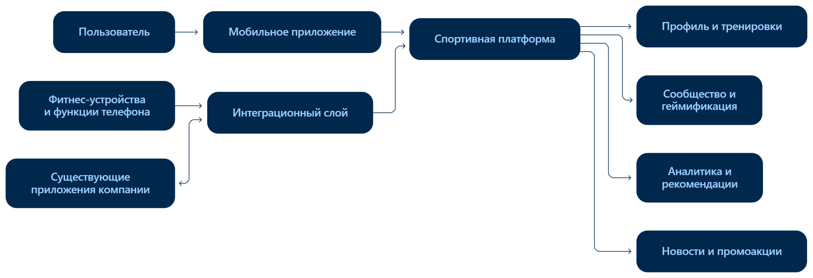

# 4. Концептуальная архитектура

Система состоит из мобильного приложения, основной спортивной платформы
и интеграционного слоя.

Основная спортивная платформа предоставляет четыре группы возможностей:

1. профиль пользователя и работа с тренировками;
2. социальное взаимодействие и геймификация;
3. аналитика и персональные рекомендации;
4. спортивный контент и промоакции.

Интеграционный слой обеспечивает взаимодействие со сторонними
фитнес-устройствами, функциями мобильных платформ и существующими
приложениями компании.

