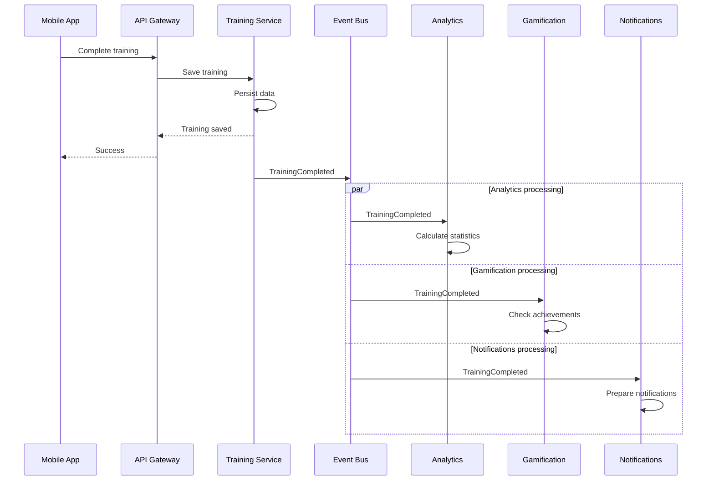

# 14.3. Многозадачность / Concurrency

Concurrency View показывает процессы, которые могут выполняться одновременно
и независимо друг от друга.

Главным примером является обработка завершённой тренировки.



# Основной принцип

Ответ пользователю не должен зависеть от завершения всех вторичных операций.

```text
Save Training
      |
      v
Response to User
      |
      +-----------------------------+
      |              |              |
      v              v              v
 Analytics      Gamification    Notifications
```

Это позволяет выполнять фоновые операции параллельно и независимо
масштабировать соответствующие компоненты.

---

# Повторная доставка событий

Асинхронная система должна учитывать возможность повторной доставки одного и
того же сообщения.

Поэтому обработчики событий должны быть идемпотентными.

Пример:

```text
EventId = 12345

TrainingCompleted
       |
       v
Gamification

Event already processed?
       |
   +---+---+
   |       |
  yes      no
   |       |
 ignore   process
```

Это предотвращает повторное создание достижений или другие побочные эффекты
при повторной доставке сообщения.