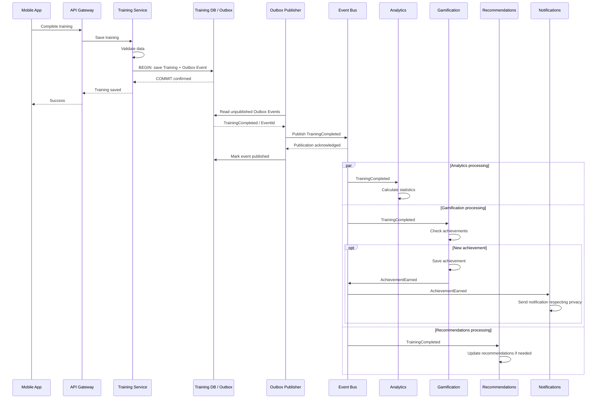

# 14.3. Многозадачность / Concurrency

Concurrency View показывает процессы, которые могут выполняться одновременно
и независимо друг от друга.

Главным примером является обработка завершённой тренировки.



# Основной принцип

Ответ пользователю не должен зависеть от завершения всех вторичных операций.

```text
Save Training + Outbox Event in one transaction
      |
      v
Response to User
      |
      v
Outbox Publisher
      |
      v
Event Bus: TrainingCompleted
      |
      +-----------------------------+
      |              |              |
      v              v              v
 Analytics      Gamification    Recommendations
                     |
                     v
             AchievementEarned
                     |
                     v
                 Event Bus
                     |
                     v
                Notifications
```

Это позволяет выполнять фоновые операции параллельно и независимо
масштабировать соответствующие компоненты.

Outbox Publisher работает независимо: подтверждение пользователю не требует
публикации в broker. При недоступности broker событие остаётся в outbox и будет
отправлено повторно, согласно [ADR-014](../../adr/ADR-014-transactional-outbox.md).
Результаты вторичной обработки могут появляться с небольшой задержкой
из-за eventual consistency.

---

# Повторная доставка событий

Асинхронная система должна учитывать возможность повторной доставки одного и
того же сообщения.

Поэтому обработчики событий должны быть идемпотентными.

Повторная публикация возможна и при сбое Outbox Publisher между подтверждением
broker и отметкой события как опубликованного. Защита от повторных эффектов
нужна для `TrainingCompleted` и `AchievementEarned`, включая отправку уведомлений.

Пример:

```text
EventId = 12345

TrainingCompleted
       |
       v
Gamification

Event already processed?
       |
   +---+---+
   |       |
  yes      no
   |       |
 ignore   process
```

Это предотвращает повторное создание достижений или другие побочные эффекты
при повторной доставке сообщения.
