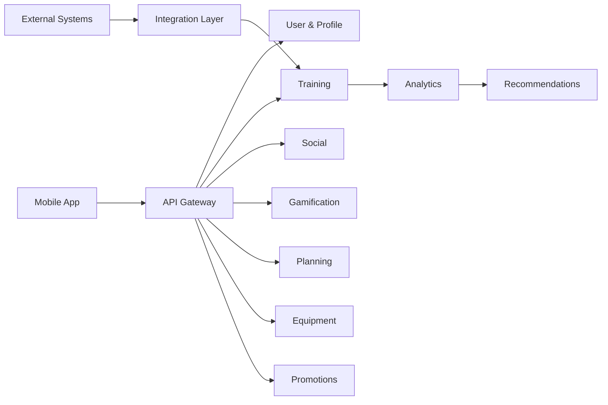

# 14.1. Функциональное представление

Функциональное представление показывает основные функциональные части системы
и ответственность каждой из них.

## User & Profile

Отвечает за:

- профиль пользователя;
- настройки;
- спортивные интересы;
- настройки приватности.

## Training

Отвечает за:

- регистрацию тренировок;
- историю тренировок;
- основные спортивные показатели;
- маршруты.

## Social

Отвечает за:

- друзей;
- группы;
- поиск спортсменов;
- совместные активности.

## Gamification

Отвечает за:

- достижения;
- соревнования;
- челленджи;
- рейтинги.

## Analytics

Отвечает за:

- статистику;
- агрегированные показатели;
- сравнение результатов;
- прогресс пользователя.

## Recommendations

Отвечает за персонализацию и рекомендации.

## Planning

Отвечает за планы и расписание тренировок.

## Equipment

Отвечает за спортивный инвентарь пользователя.

## Promotions

Отвечает за:

- новости;
- акции;
- региональные предложения.

## Integration Layer

Отвечает за интеграцию с:

- спортивными устройствами;
- фитнес-функциями мобильных платформ;
- существующими приложениями компании.