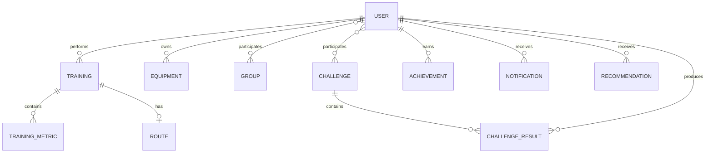

# 14.2. Информационное представление

Информационное представление описывает основные информационные сущности системы
и отношения между ними.



# Основные сущности

## User

Основная информация:

- UserId;
- профиль;
- спортивные интересы;
- регион;
- privacy settings.

---

## Training

Основная информация:

- TrainingId;
- UserId;
- SportType;
- StartTime;
- EndTime;
- Distance;
- Status.

---

## TrainingMetric

Хранит отдельные показатели тренировки.

Примеры:

- heart rate;
- speed;
- oxygen;
- cadence.

Основная информация:

- Timestamp;
- MetricType;
- Value;
- Source.

---

## Route

Содержит информацию о маршруте тренировки.

Маршрут и географические точки рассматриваются как чувствительная
пользовательская информация.

---

## Equipment

Основная информация:

- EquipmentId;
- Type;
- Model;
- PurchaseDate;
- Usage.

---

## Challenge

Основная информация:

- ChallengeId;
- Rules;
- Period;
- Region;
- Participants.

---

# Владение данными

Каждая доменная область является владельцем своих данных.

```text
Profile          -> User data
Training         -> Training data
Social           -> Social graph
Gamification     -> Challenges / Achievements
Equipment        -> Equipment data
Promotions       -> Campaigns
```

Компоненты не должны напрямую обращаться к хранилищам данных других доменных
областей.

Обмен информацией выполняется через:

- API;
- доменные события.