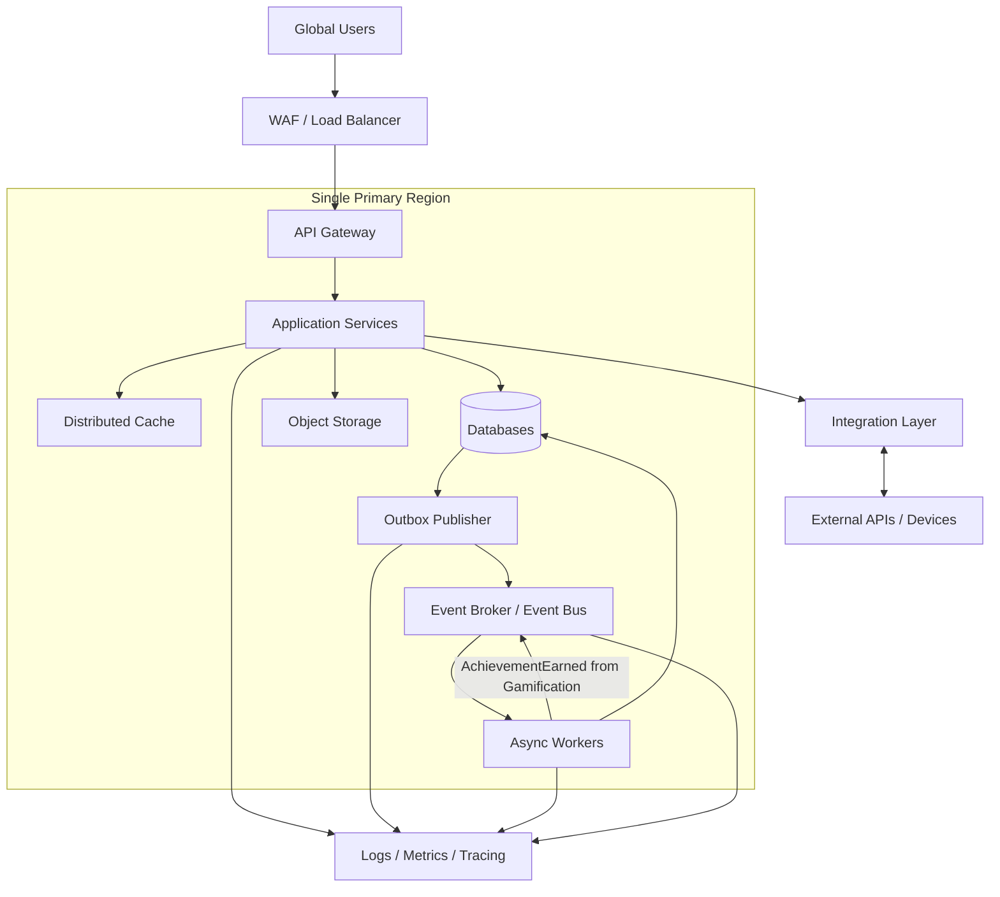
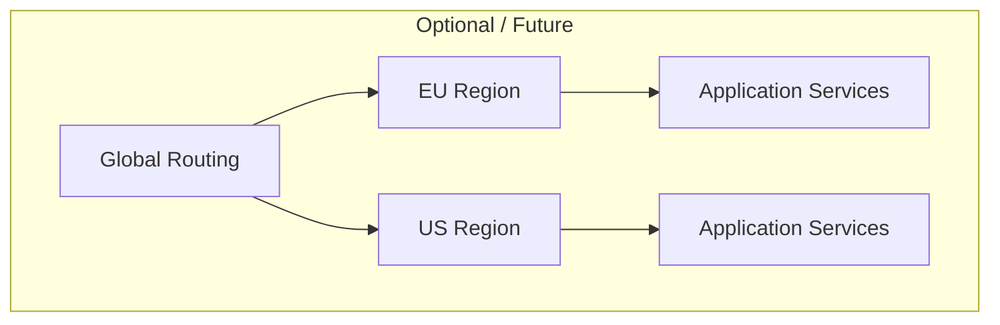

# 14.4. Инфраструктурное представление

Инфраструктурное представление показывает основные инфраструктурные компоненты
системы.

На данном этапе архитектура не привязана к конкретному облачному провайдеру.

## Current / baseline infrastructure

Базовое развёртывание предполагает один основной регион. Количество deployable
units и экземпляров определяется этапом реализации; логические домены не требуют
отдельных сервисов с первого релиза (ADR-001).

Training сохраняет тренировку и Outbox Event в одной локальной транзакции своего
хранилища. Publisher доставляет `TrainingCompleted` в broker, затем отмечает
событие опубликованным. Отправка ответа пользователю не ожидает broker или workers
(ADR-008, ADR-014).

Async Workers независимо обрабатывают `TrainingCompleted` для Analytics,
Gamification и Recommendations. При новом достижении Gamification публикует
`AchievementEarned`, который обрабатывает Notifications.

Узел Databases обозначает инфраструктуру хранения: логическое владение данными
остаётся у доменов, а общая физическая инфраструктура на раннем этапе не разрешает
прямой доступ к данным другого домена (ADR-006).

# WAF / Load Balancer

Отвечает за:

- защиту внешнего периметра;
- распределение входящей нагрузки;
- маршрутизацию запросов.

---

# API Gateway

Предоставляет единую точку входа в backend API.

---

# Application Services

Содержат основные бизнес-компоненты платформы.

Компоненты должны иметь возможность масштабироваться независимо.

---

# Event Broker

Используется для асинхронного обмена событиями между компонентами.

---

# Distributed Cache

Используется для данных, которые:

- часто читаются;
- допускают кеширование;
- не требуют постоянного обращения к основному хранилищу.

Примеры:

- рейтинги;
- справочники;
- популярные группы.

---

# Object Storage

Может использоваться для хранения:

- изображений;
- больших объектов;
- пользовательских файлов;
- экспортированных данных.

---

# Observability

Система должна централизованно собирать:

- logs;
- metrics;
- traces;
- alerts.

---

## Future / optional scaling capabilities

CDN и multi-region рассматриваются как возможности дальнейшего масштабирования,
а не как принятые обязательства текущего развёртывания.

# CDN / Edge — Optional / Future

[ADR-012](../../adr/ADR-012-cdn.md) имеет статус Proposed.
CDN вводится при подтверждённой необходимости глобальной доставки публичного
контента и не является обязательной частью MVP.

Может использоваться для:

- статических ресурсов;
- изображений;
- публичного контента;
- снижения задержки для глобальной аудитории.

---

# Региональное развёртывание — Optional / Future

Так как приложение ориентировано на глобальную аудиторию, архитектура должна
допускать развёртывание компонентов в нескольких регионах.

Multi-region вводится после появления подтверждённых требований latency,
availability или data residency. [ADR-011](../../adr/ADR-011-regional-deployment.md)
остаётся Proposed.

Конкретный вариант:

- active-active;
- active-passive;
- разделение данных по регионам;

должен определяться при уточнении ADR-011 после появления количественных требований
по нагрузке, доступности и размещению данных.
