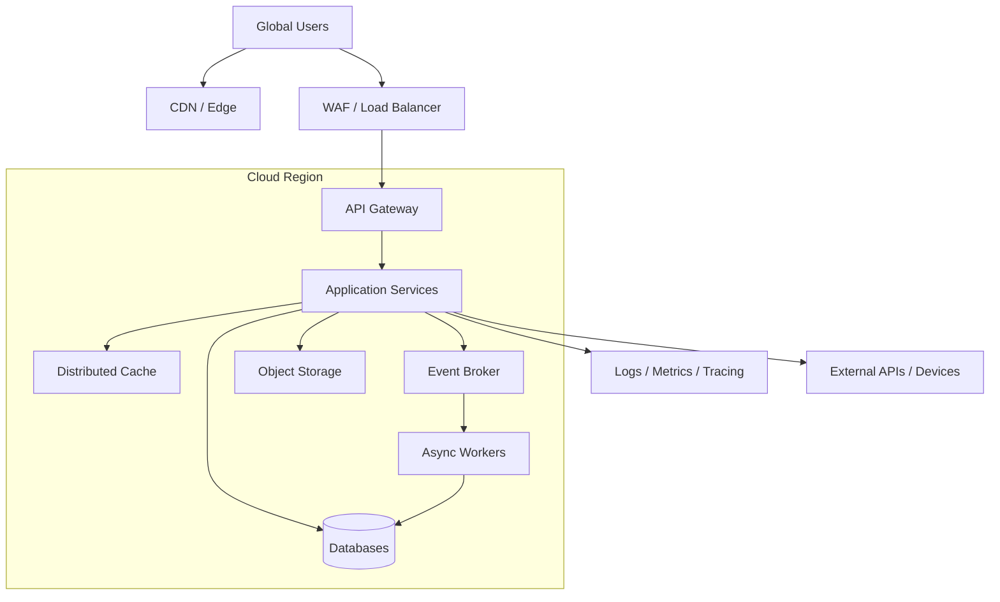
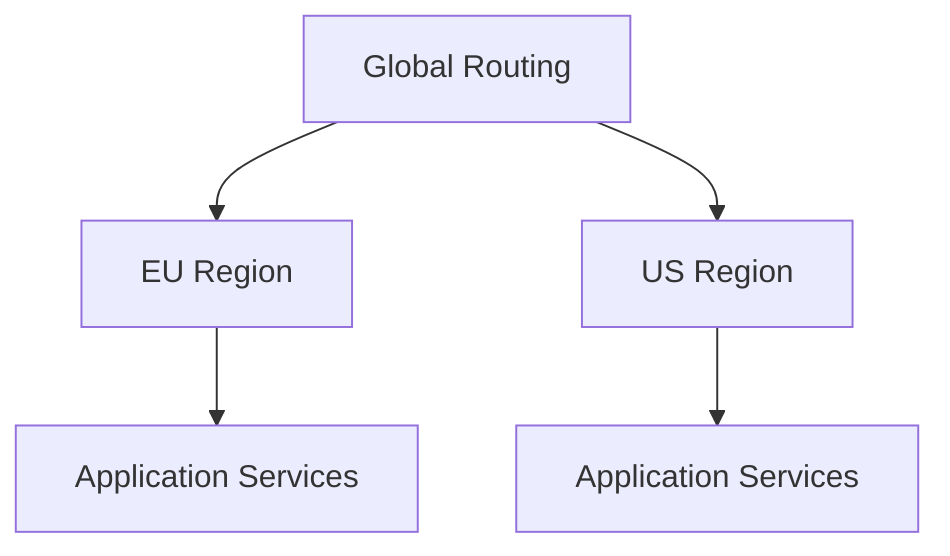

# 14.4. Инфраструктурное представление

Инфраструктурное представление показывает основные инфраструктурные компоненты
системы.

На данном этапе архитектура не привязана к конкретному облачному провайдеру.

# CDN / Edge

Может использоваться для:

- статических ресурсов;
- изображений;
- публичного контента;
- снижения задержки для глобальной аудитории.

---

# WAF / Load Balancer

Отвечает за:

- защиту внешнего периметра;
- распределение входящей нагрузки;
- маршрутизацию запросов.

---

# API Gateway

Предоставляет единую точку входа в backend API.

---

# Application Services

Содержат основные бизнес-компоненты платформы.

Компоненты должны иметь возможность масштабироваться независимо.

---

# Event Broker

Используется для асинхронного обмена событиями между компонентами.

---

# Distributed Cache

Используется для данных, которые:

- часто читаются;
- допускают кеширование;
- не требуют постоянного обращения к основному хранилищу.

Примеры:

- рейтинги;
- справочники;
- популярные группы.

---

# Object Storage

Может использоваться для хранения:

- изображений;
- больших объектов;
- пользовательских файлов;
- экспортированных данных.

---

# Observability

Система должна централизованно собирать:

- logs;
- metrics;
- traces;
- alerts.

---

# Региональное развёртывание

Так как приложение ориентировано на глобальную аудиторию, архитектура должна
допускать развёртывание компонентов в нескольких регионах.

Конкретный вариант:

- active-active;
- active-passive;
- разделение данных по регионам;

должен определяться отдельным ADR после появления количественных требований
по нагрузке и доступности.