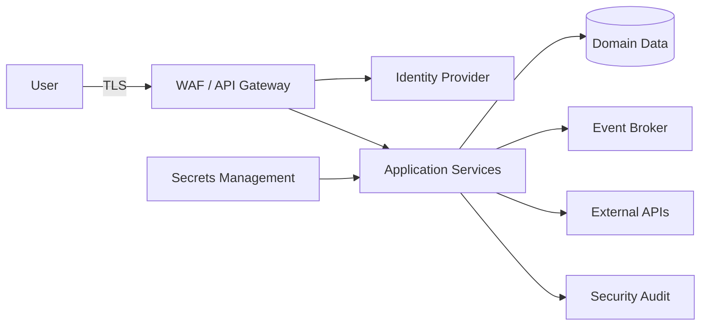

# 14.5. Представление безопасности

Security View описывает основные границы безопасности, механизмы доступа
и подходы к защите пользовательской информации.



# Аутентификация

Все пользовательские запросы должны проходить централизованную
аутентификацию.

Для клиентских приложений используется token-based authentication.

---

# Авторизация

После аутентификации система должна проверять права пользователя на выполнение
операции и получение запрашиваемых данных.

Пользователь должен иметь доступ только к разрешённой ему информации.

---

# Настройки приватности

Особенно чувствительной является информация о:

- геолокации;
- маршрутах пользователя;
- текущем месте тренировки;
- физиологических показателях.

Пользователь должен иметь возможность управлять доступностью своих данных.

Пример:

```text
Показывать тренировку:

[ ] Всем
[x] Друзьям
[ ] Только мне


Показывать текущее местоположение:

[ ] Да
[x] Нет
```

---

# Шифрование данных

## Data in transit

Передача пользовательских и служебных данных должна выполняться по
защищённым соединениям.

Для внешних соединений применяется TLS.

## Data at rest

Чувствительная информация должна храниться с применением механизмов
шифрования выбранного инфраструктурного решения.

---

# Service-to-Service Security

Внутренняя сеть не должна автоматически считаться доверенной.

Для взаимодействия компонентов должны применяться:

- идентификация сервисов;
- минимально необходимые права;
- разграничение доступа.

---

# Secrets Management

Пароли, API keys, сертификаты и другие секреты не должны храниться:

- в исходном коде;
- в Git;
- в Docker image;
- в открытых конфигурационных файлах.

Для секретов должно использоваться централизованное защищённое хранилище.

---

# Security Audit

Система должна фиксировать критичные с точки зрения безопасности события.

Например:

- изменение настроек приватности;
- доступ к чувствительным данным;
- подключение внешнего устройства;
- изменение разрешений;
- административные действия.

---

# Принцип минимизации данных

Система должна собирать и хранить только ту пользовательскую информацию,
которая необходима для реализации соответствующей функции.

Особое внимание уделяется геолокации и данным, поступающим от спортивных
устройств.